<div align="center">
  <h1>flowerpayment-ai 鲜花商店 + ai</h1>
  <h2>flowerpayment-ai：B2C 经营模式，一个花店卖家，多个买家。鲜花服务由店长、店员和客户组成。</h2>
  <h4>
    一个由 Spring Boot 3 + Vue 3 的前后端分离架构，中间件使用 Redis + nginx，主业务为鲜花礼品订单和支付的全栈系统和Spring AI（使用阿里云的qwen），通过图像识别,帮顾客推荐相似花束，并支持 LLM 生成贺卡文案，tts配音贺语。
  </h4>
</div>


<div align="center">
    <h1>
    
    
    
    
    
    
    
    </h1>
</div>
------

# 数据流向图

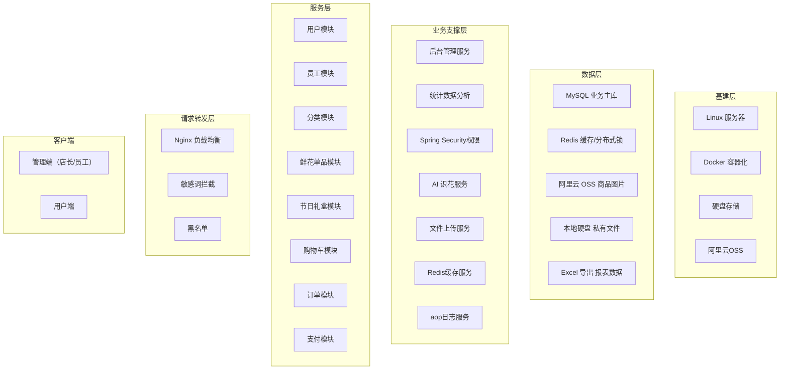

业务

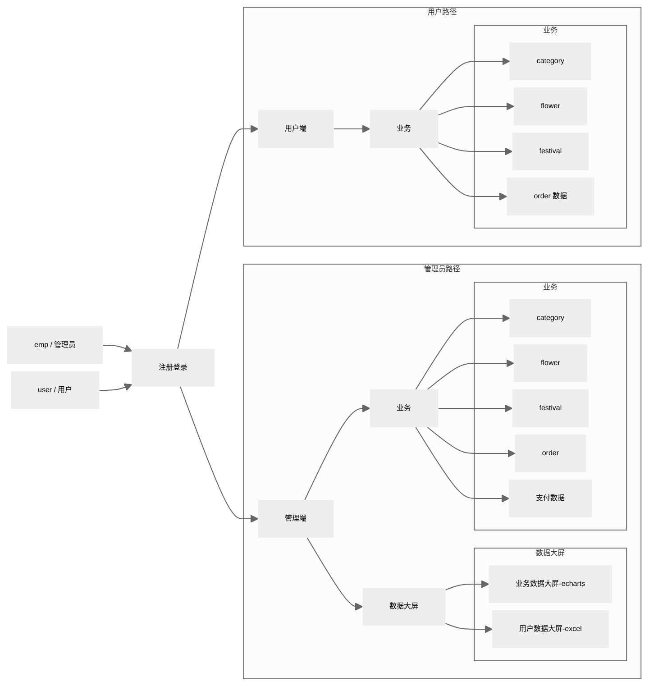


| 启动步骤     | 1创建数据库并导入 `sql/` 目录脚本。 <br/>2 修改 `start/src/main/resources/application-dev.yml` 中数据库与 Redis 配置。<br/>3 `npm run dev ` 前端启动服务。 |
| ------------ | ------------------------------------------------------------ |
| **升级方向** | 使用nacos+gateway连接主业务+ai业务，灰度更新，分布式部署，故障转移等等。 |

仓库结构

```
flower/
├── spring-flower/                 # 后端代码（Spring Boot 3 多模块）
│   ├── common/                    # [共用] 公共模块（工具类、全局配置、异常等）
│   ├── model/                     # [共用] 实体类与数据传输对象（Entity/DTO/VO）
│   ├── mapper/                    # [共用] 数据访问层（MyBatis-Plus Mapper）
│   ├── service/                   # [共用] 业务逻辑层（Service接口及实现）
│   ├── start/                     # [main服务] 主业务启动模块
│   └── ai/                        # [branch服务] AI扩展服务启动模块
│
├── vue-flower/                    # 前端管理端（Vue 3）
│   ├── src/
│   │   ├── api/                   # API接口封装（axios 请求）
│   │   ├── views/                 # 页面视图组件
│   │   ├── layout/                # 全局布局组件
│   │   ├── router/                # 路由配置
│   │   ├── stores/                # 状态管理（Pinia）
│   │   └── utils/                 # 前端工具函数
│   └── package.json               # 前端依赖配置
│
├── database-sql/                  # 数据库脚本目录
│   ├── sql.txt                    # 数据库建表语句
│   ├── sql插入数据.txt             # 数据库初始化数据SQL
│   └── 数据库设计文档.md           # 数据库表结构设计与说明
│
└── 说明/                           # 项目说明与文档目录
    ├── 原型功能/                   # 前端原型截图
    ├── 支付宝+qq/                  # 第三方应用注册与支付集成说明
    ├── 并发测试/                   # 使用 JMeter 进行并发测试的日志与结果
    │   ├── flowr-category/         # Spring Cache 数据日志与压测结果
    │   ├── flowr/                  # Redis 数据日志与压测结果
    │   └── festival/               # Redis 数据日志与压测结果
    ├── 运行日志.txt                 # 项目运行日志
    ├── admin接口文档.md             # 管理员端接口详情
    └── user接口文档.md              # 用户端接口详情
```


# 前端说明

技术栈：Vue 3 + Element Plus + Pinia + Vue Router + echarts

## 管理端界面

| 功能页面  |                             截图                             |
| :-------: | :----------------------------------------------------------: |
| 登录页面  | 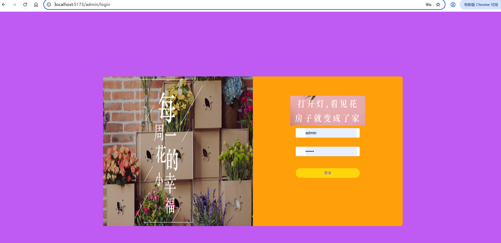 |
|   分类    |                                                              |
| 单花销售  |                                                              |
| 组合销售  |                                                              |
| 订单管理  |                                                              |
|   店铺    |                                                              |
|   员工    |                                                              |
| 业务大屏1 |                                                              |
| 业务大屏2 |                                                              |
| 业务大屏3 |                                                              |

## 用户端界面

|   功能页面   | 截图 |
| :----------: | ---- |
|   登录页面   |      |
|     分类     |      |
|   单花销售   |      |
|   组合销售   |      |
|     店铺     |      |
|    购物车    |      |
|     订单     |      |
| AI（多模态） |      |


# 后端说明

## 一、店长、店员和客户多端端登录认证模块

### 迭代过程

1. 早期版本：单过滤器 if-else 区分账号类型，新增 QQ / 支付宝第三方登录后逻辑爆炸；优化为过滤器链接力模式，解耦多端登录逻辑。
2. 早期只校验 JWT 签名，支持伪造永久 Token；新增 Redis 缓存校验，实现登录状态后端可控。
3. 最初使用固定 TTL，活跃用户频繁掉线；改造为滑动过期，留存提升明显。

```
Q：为什么不用一个过滤器统一解析两种 Token？
答：单过滤器会出现大量类型判断分支，后续扩展第三方登录、多角色账号时维护成本极高；拆分过滤器采用接力放行模式，每个过滤器只关心自己对应的账号类型，符合开闭原则。
Q：滑动过期会不会产生大量无效 Redis Key？
答：设置最大基础 TTL 兜底，即使用户长期不操作，缓存自动(expire:24小时)淘汰；登出接口主动删除对应 key，减少无效缓存堆积。
Q: 放弃 MD5，使用BCrypt 密码加密存储优点？
不使用 MD5/SHA256 不可逆哈希，BCrypt 自带随机盐值，抗彩虹表暴力破解，数据库永不存储明文密码。
Q: 如何用户权限隔离？
 1.	service的方法层拦截
 @PreAuthorize("hasAuthority('ROLE_ADMIN')")
 2. controller的url拦截
.requestMatchers("/admin/**").hasAnyAuthority("ROLE_ADMIN", "ROLE_EMP")
.requestMatchers("/user/**").hasAuthority("ROLE_USER")
```

------

## 二、flower-category模块

### model

1. 数据表 

   ```
   flower_category
   ```

   字段：id、分类名称、type 、排序、状态、删除标记；

   索引：type 普通索引，按类型快速筛选分类。

3. Redis 缓存结构，springcache成本低

   ```
   @CacheConfig(cacheNames = RedisPrefixConstant.CATEGORY_TYPE_PREFIX)
   ```


### 迭代过程
排除冷启动的（第一次，第1000次)达到稳定，进行统计
| jmeter每次1000次                                             | 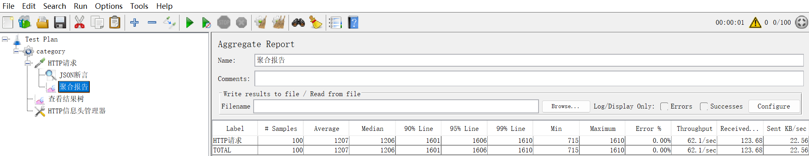 |
| ------------------------------------------------------------ | ------------------------------------------------------------ |
| 没有缓存，并发1000次                                         | 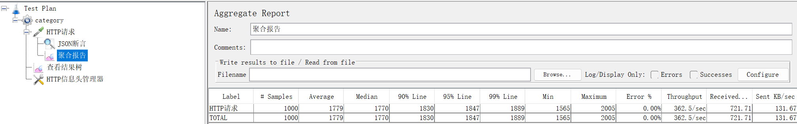    |
| 没有缓存，并发1000次                                         | 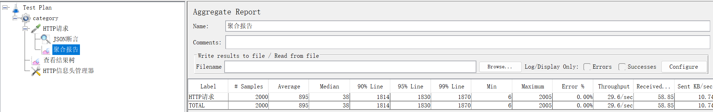    |
| 没有缓存，并发1000次                                         | 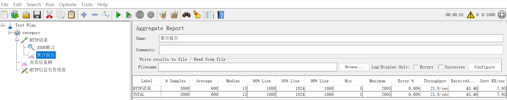    |
| 无缓存的情况是全程没有使用 redis 的稳定情况                  | 说明/并发测试/flower-category-运行日志-没有缓存日志.txt      |
| 有spring-cache缓存，再并发1000次                             | 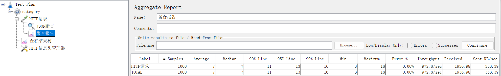        |
| 有spring-cache缓存，再并发1000次                             | 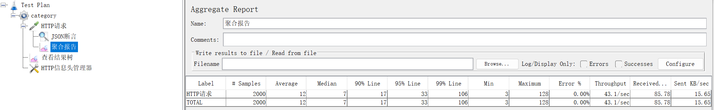        |
| 有spring-cache缓存，再并发1000次                             | 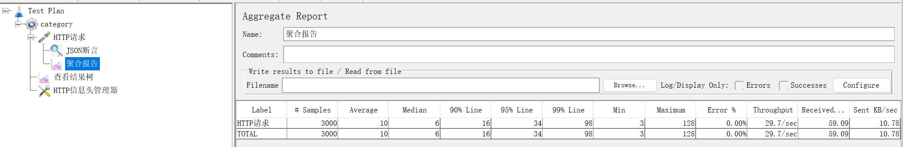        |
| 有缓存的情况是全程有 redis 的稳定情况                        | 说明/并发测试/flower-category-运行日志-缓存日志.txt          |
| 计算说明：性能提升百分比 =(无缓存值‑有缓存值)/ 无缓存值 ×100%；吞吐量提升百分比 =(有缓存‑无缓存)/ 无缓存 ×100%。 | **响应时间**：开启缓存后接口全量响应指标得到极大优化。无缓存场景平均响应时间 600ms，开启缓存后平均响应仅 10ms，平均响应性能提升**98.3%**。90%、95%、99% 分位耗时下降尤为明显；无缓存场景高百分位接近 1800ms，开启缓存 99 分位仅 98ms。无缓存时需要完整执行业务逻辑、访问数据库；命中缓存直接读取缓存数据，极大降低接口处理时延。 **吞吐量**：无缓存吞吐量 21.8 请求 / 秒；开启缓存吞吐量提升至 29.7 请求 / 秒，吞吐量提升**36.2%**，系统整体并发处理能力增强。 **网络流量**：接收速率从 43.46KB/sec 提升至 59.09KB/sec，发送速率从 7.93KB/sec 提升至 10.78KB/sec，单位时间网络数据处理能力随吞吐量同步上涨。 |

## 三、flower模块，festival模块

1. 鲜花单品模块

- 分类：鲜花单品 = 1 : N（`flower.category_id`关联分类表）
- 鲜花单品：鲜花规格`flower_detail` = 1 : N

> - spec_object：送人对象（恋人 / 朋友 / 长辈）
> - spec_option：用途（表白、生日、道歉）

2. 节日礼盒模块

- `festival`节日礼盒主表，代表一个成品礼盒商品（比如 “520 热恋礼盒”）

- `festival_detail`礼盒明细：一个礼盒包含多朵鲜花，一条明细代表礼盒里面的一款鲜花，同时携带该鲜花的送人对象、用途规格。

- 关系：`festival` : `festival_detail` = 1 : N

  >- spec_object：送人对象（恋人 / 朋友 / 长辈）
  >- spec_option：用途（表白、生日、道歉）

3. 索引

index idx_festival_id (festival_id)、index idx_flower_id (flower_id).

 1 大幅提升数据检索速度（避免全表扫描） 

 2 优化 ORDER BY 和 GROUP BY 操作

---

**缓存设计：因为flower模块 festival模块的价格存在因为节日，花的保质期限制处于动态变化不能直接返回旧数据，异步更新后拿到新数据再返回，返回新数据**

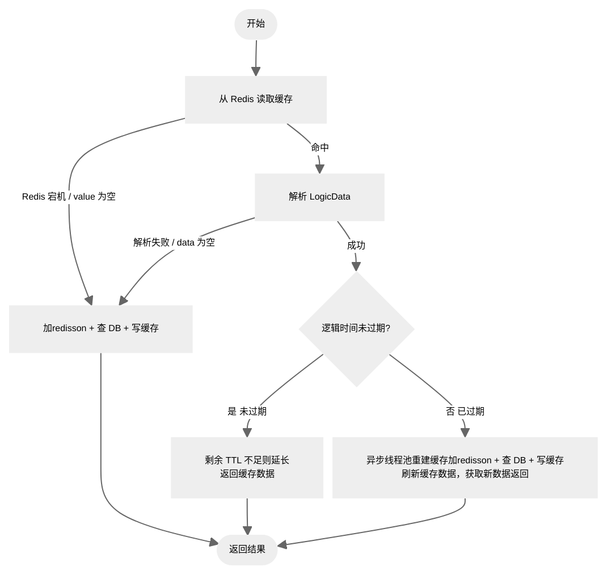


**DB查询**


### 迭代过程

|           早期问题           |                           我的方案                           |
| :--------------------------: | :----------------------------------------------------------: |
|           缓存穿透           |          空值缓存 + 短 TTL60s，查询为空也写入 Redis          |
|           缓存击穿           | 逻辑过期 + Redisson 分布式锁 + 异步重建；持锁线程异步更新，其余请求返回旧缓存 |
|           缓存雪崩           | 基础 TTL 叠加 ±10% 随机偏移；列表、详情缓存设置不同过期周期  |
|       缓存数据库一致性       |                       兜底物理 TTL24h                        |
| 悲观锁不能解决集群和并发问题 | Redisson 可重入分布式锁 + 看门狗自动续期；加锁后双重检查缓存 |
|    redis宕机的突发性问题     | Redis 不可用：降级直查数据库<br> log.info("Redis 宕机:{}", e.getMessage()); Flower flower = this.getMysql(id); return BeanUtil.toBean(flower, FlowerVO.class); |

排除冷启动的（第一次，第 500 次)达到稳定，进行统计。因为本地测试性能影响，最大值设置 500

### flower

| jmeter并发500次                                              | 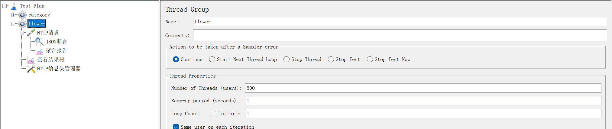    |
| ------------------------------------------------------------ | ------------------------------------------------------------ |
| 没有缓存，再开启 500次并发                                   | 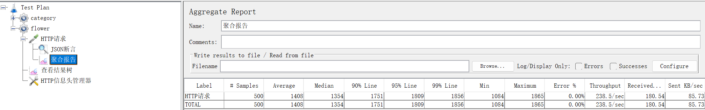             |
| 没有缓存，再开启 500次并发                                   | 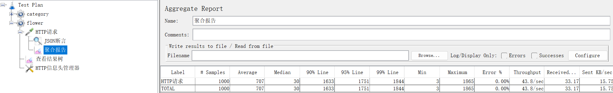             |
| 没有缓存                                                     | 说明/并发测试/flower-运行日志-没有缓存.txt                   |
| 有redis缓存，再开启 500次并发                                | 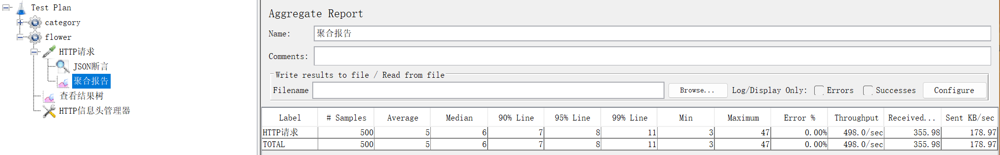                 |
| 有redis缓存，再开启 500次并发                                | 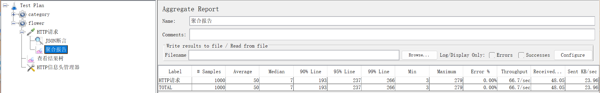                 |
| 有redis缓存                                                  | 说明/并发测试/flower-运行日志-缓存.txt                       |
| 90% Line 含义：90% 的请求响应耗时不大于该数值，分位数指标用于评估接口稳定性，相比平均响应时间更能反映真实用户访问体验。 | 无缓存场景：90% 请求响应时间 1633ms，95% 请求响应时间 1751ms，99% 请求响应时间 1844ms。 开启缓存场景：90% 请求响应时间 193ms，95% 请求响应时间 237ms，99% 请求响应时间 266ms。<br> 90 分位：响应时间下降 88.18%； 95 分位：响应时间下降 86.46%； 99 分位：响应时间下降 85.57%。 |

### festival

| jmeter并发                    | 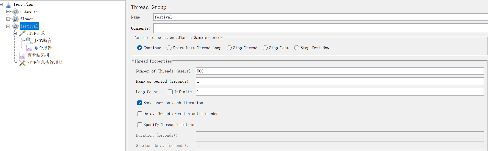  |
| ----------------------------- | ------------------------------------------------------------ |
| 没有缓存，再开启 500次并发    | 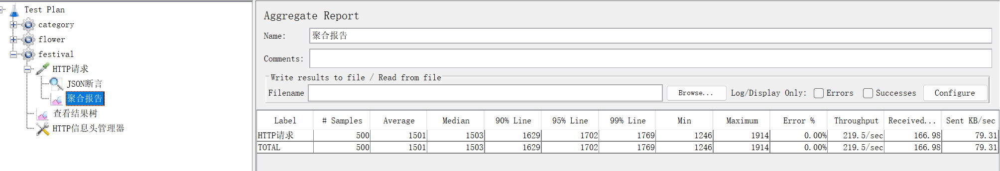           |
| 没有缓存，再开启 500次并发    | 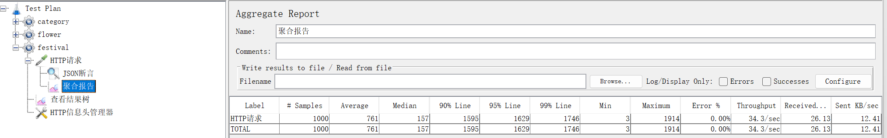           |
| 没有缓存                      | 说明/并发测试/festival-运行日志-没有缓存.txt                 |
| 有redis缓存，再开启 500次并发 | 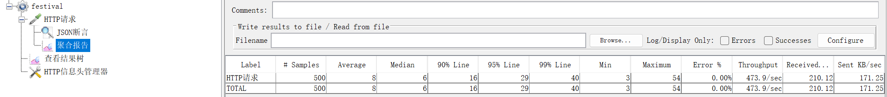               |
| 有redis缓存，再开启 500次并发 | 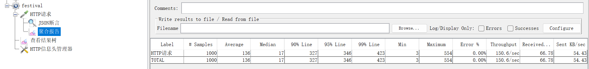               |
| 有redis缓存                   | 说明/并发测试/festival-运行日志-缓存.txt                     |
| 对比                          | 无缓存场景：接口平均响应时间 761ms，90% 请求响应时间 1595ms，95% 请求响应时间 1629ms，99% 请求响应时间 1746ms，吞吐量 34.3 次每秒，错误率 0%。 开启缓存场景：接口平均响应时间 136ms，90% 请求响应时间 327ms，95% 请求响应时间 346ms，99% 请求响应时间 423ms，吞吐量 150.6 次每秒，错误率 0%。 |

------

##  四、flower-detial模块，festival-detail模块

**缓存设计**


**DB查询**

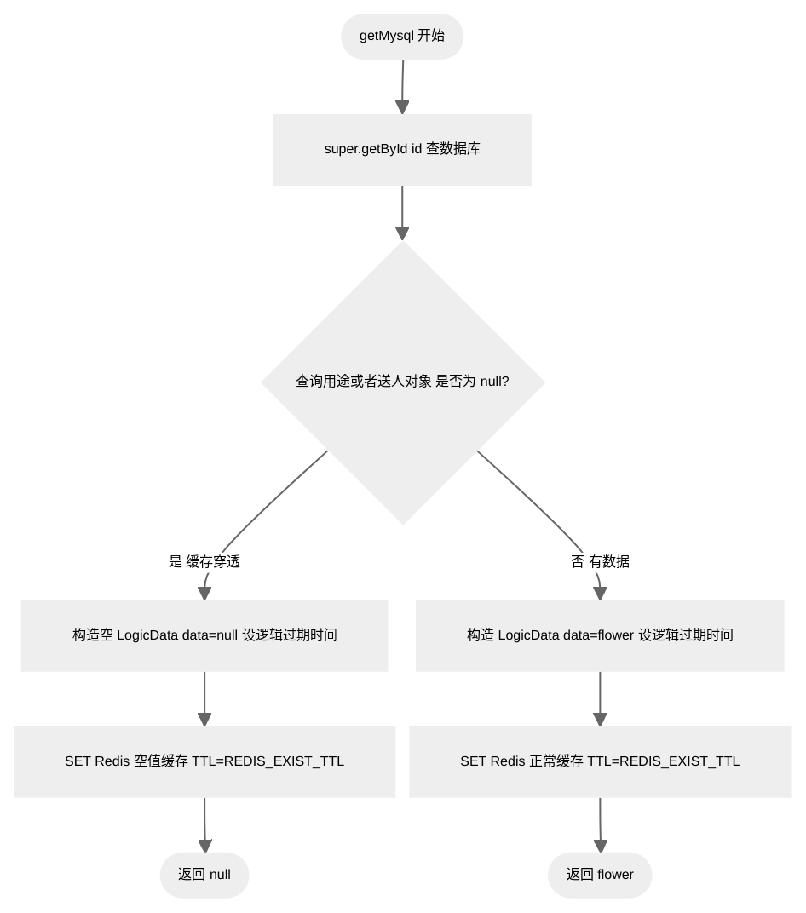

## 五、订单状态流转

第三方授权登录流程图和支付流程：支付宝

沙箱网关固定为：https://openapi-sandbox.dl.alipaydev.com/gateway.do
生产网关一般为：https://openapi.alipay.com/gateway.do

|                          支付宝授权                          |                           授权成功                           | 集成到订单                                                   | 支付过程                                                     |                           同步支付                           |                           异步检验                           |
| :----------------------------------------------------------: | :----------------------------------------------------------: | ------------------------------------------------------------ | ------------------------------------------------------------ | :----------------------------------------------------------: | :----------------------------------------------------------: |
|  | 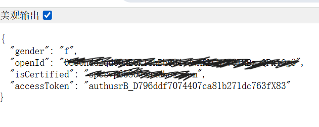 |  |  |  |  |

```
1 用户下单 → 2 用户确认支付 → 3 商家制作 → 4 工作人员取货 → 5 工作人员开始配送 → 6 工作人员已到达 → 7 用户确认
        → 8 已取消（未接单退款、商家拒单、超时取消、退款）
```

## 六、user模块

### user-address

|        业务难点        |                         场景                          |                           解决方案                           |                           选型理由                           |
| :--------------------: | :---------------------------------------------------: | :----------------------------------------------------------: | :----------------------------------------------------------: |
|   多默认地址数据违规   |       新增 / 修改地址勾选默认，旧默认地址未取消       | 设为默认前先批量更新该用户所有地址 isDefault=0，两步操作绑定业务逻辑 | 数据库无法直接约束单用户唯一默认，代码层前置清理旧默认，保证业务数据合规 |
| 传统分页深分页性能衰减 | 用户地址数量较多时，pageNum=100 需要扫描前 100 页数据 |  游标滚动分页，以上一页最后一条 id 作为游标，直接走主键索引  | 游标分页性能稳定不随页码增长衰减，统一项目分页返回结构 ScrollResult |

### user-shopping

```
Q:放弃 MySQL 持久化，采用 Redis Hash 存储?
购物车是临时会话数据，用户退出、下单完成即可清空，不需要持久化；Redis 读写 O (1)，支撑高并发增减购物车操作，集群多实例数据共享。
Q:Redis Hash 结构
   外层 key：shopping_cart:{userId}
   内层 field：购物项唯一 id，value：商品完整信息 JSON（菜品 / 套餐 id、名称、数量、口味、金额）
   优势：单用户购物车聚合存储，增删单项无需操作整条数据，性能优于 String 序列化列表。。

```

### shop店铺

仅两个状态值，高频读写、无需持久化报表，存入 Redis 读写 O (1)；多实例共享同一缓存，状态实时同步，无需事务、数据表，轻量化实现。

|       业务难点       |                     场景                     |                解决方案                 |                    选型理由                    |
| :------------------: | :------------------------------------------: | :-------------------------------------: | :--------------------------------------------: |
| 高频查询店铺营业状态 | 每个用户进店、下单前都校验状态，并发访问频繁 | Redis 单 key 存储状态，查询无数据库 IO  |  相比 MySQL 查询延迟大幅降低，减轻数据库压力   |
|    集群状态不同步    |      单实例内存变量存储，多节点状态独立      | 统一 Redis 集中存储店铺状态，全实例共享 | 分布式环境全局状态标准存储方案，一致性实时保障 |

## 七、文件管理，数据分析，aop日志

1 使用excel分许

POST /report/excel/read EasyExcel流式逐行读取解析，不加载全表到内存
GET /report/excel/download 流式写入Response输出流，边写边返回，不占用堆内存

2 折线图，条形图，块图分析

3 文件上传
本地：写入项目image目录，返回本地访问路径
OSS：上传云端，返回CDN加速访问URL

1. 双存储环境隔离
   使用硬盘存储，对于内部的用户数据，敏感数据和重要文档。切换 OSS 加速、多实例共享文件、无限扩容，存储公共数据。
2. UUID 重命名策略
   丢弃原始文件名，UUID + 后缀生成全新文件名，解决重名覆盖、路径遍历攻击、中文乱码三大问题。

4 采用注解 + AOP 切面实现日志统一收集，自定义注解区分增删改查操作类型，切面统一采集上下文登录人、请求参数、耗时。

|       业务难点       |                场景                |                      解决方案                      |                          选型理由                           |
| :------------------: | :--------------------------------: | :------------------------------------------------: | :---------------------------------------------------------: |
| 日志逻辑侵入业务代码 | 每个 CRUD 方法手动写日志，代码冗余 | AOP 切面统一拦截，注解标记即可自动记录，无业务侵入 | 符合 AOP 面向切面设计思想，日志属于横向通用能力，与业务解耦 |

## 八、AI模块

1 拍照识别鲜花，帮助消费者识别专有的鲜花名,  帮助购买。

> 对面买的那多花？不知这个，就是那朵红色花？
>
> 改成 ai 识别出周围人花 ，用户告诉服务员，想买红色的玫瑰花

spring alibaba graph 编排流程图：

保留了图片识别结果的返回，下一个节点ai查询信息可能存在不准情况，识别的结果也可以帮助consumer判断和使用

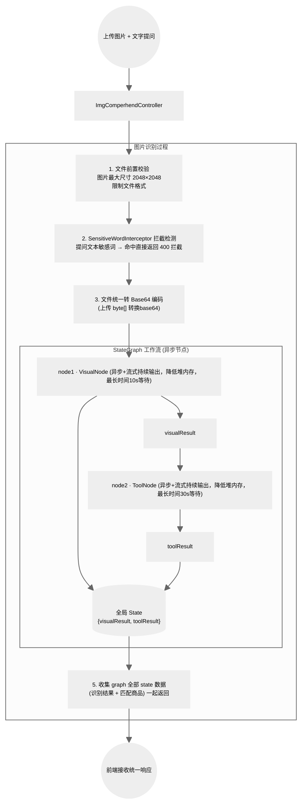

节点

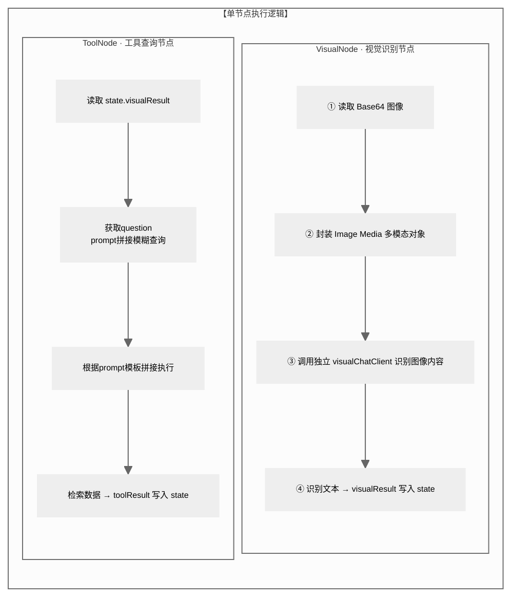

2 LLM 生成个性化贺卡文案

```
思路：使用提示词模板，提前写好提示词使用，匹配个性化贺卡文案
PromptTemplate promptTemplate = new PromptTemplate("根据信息{input} 进行文案写作，----等等");
promptTemplate.add("input", input);
```

## 九、websocket

节日的时效性，某些花需要在特定的时间准时送达到特定场合，通过websocket提醒商家

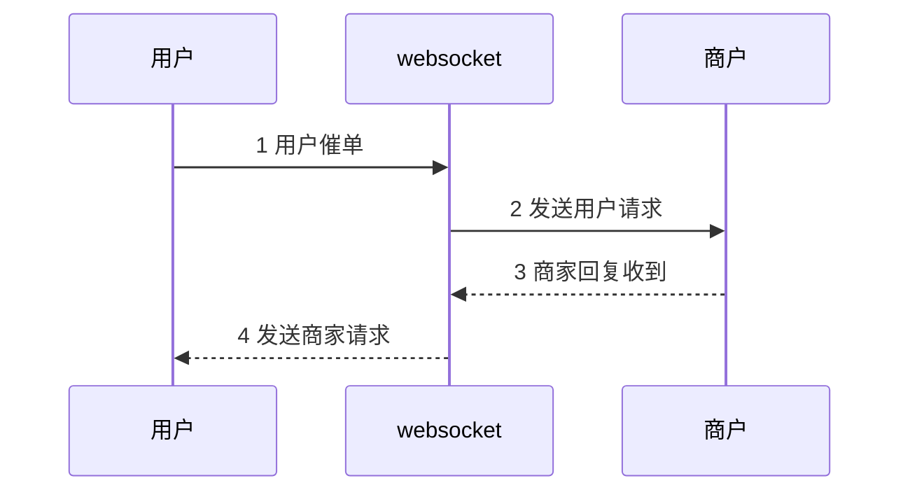

