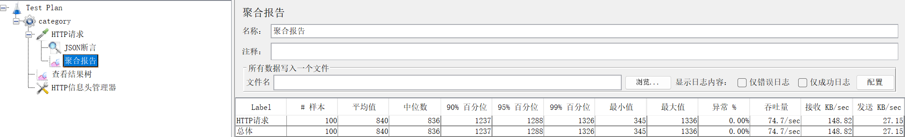
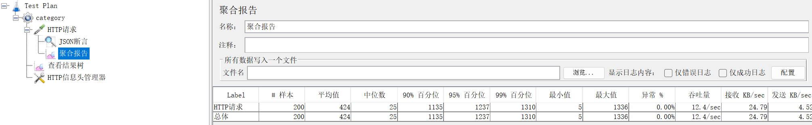
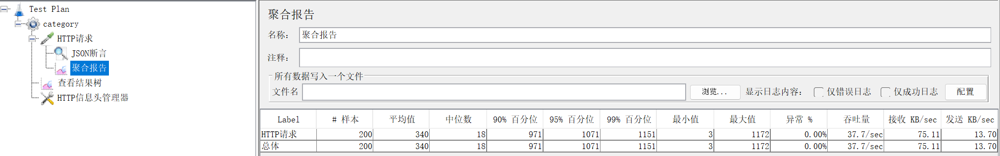

<div align="center">
  <h1>flowerpayment-ai 鲜花商店 + ai</h1>
  <h2>flowerpayment-ai：B2C 经营模式，一个花店卖家，多个买家。鲜花服务由店长、店员和客户组成。</h2>
  <h4>
    一个由 Spring Boot 3 + Vue 3 的前后端分离架构，中间件使用 Redis + nginx，主业务为鲜花礼品订单和支付的全栈系统和
    Spring AI（spring-ai-starter-model-openai + 阿里云），通过图像识别花材推荐相似花束，并支持 LLM 生成个性化贺卡文案。
  </h4>
</div>

<div align="center">
    <h1>
    
    
    
    
    
    
    
    </h1>
</div>
------

# 架构图

| 数据流向     |  |
| ------------ | ------------------------------------------------------------ |
| 总体设计     |  |
| **升级方案** | 使用nacos+gateway连接主业务+ai业务(两个服务)，灰度更新，分布式部署，故障转移等等。待后续开发。<br>当前使用mysql存储ai会话内容，高消耗和延迟，可以改成redis的IO密集型，性能更强。待后续开发。 |

**订单状态流转**：

```
1 待支付 → 2 已付款 → 3 制作中 → 4 骑手待出发 → 5 配送中 → 6 已送达 → 7 已完成 
        → 8 已取消（未接单退款、商家拒单、超时取消、售后全额退款）
```

**第三方授权登录流程图和支付流程**：支付宝

| 支付宝授权 | 授权成功 | 集成到订单 | 支付过程 | 同步支付 | 异步检验 |
| :--: | :--: | ---- | ---- | :--: | :--: |
|  |  |  |  |  |  |

**第三方授权登录流程图和支付流程**：qq

| 待完善 |      |      |      |      |
| ------ | ---- | ---- | ---- | ---- |
|        |      |      |      |      |

# 启动步骤

1. 创建数据库并导入 `sql/` 目录脚本。
2. 修改 `start/src/main/resources/application-dev.yml` 中数据库与 Redis 配置。
3. `npm run dev ` 前端启动服务。

# 项目结构

```
flower/
├── spring-flower/            			  # 后端代码（Spring Boot 3 多模块）
│   ├── common/                           # 公共模块
│   ├── model/                            # 实体与数据传输对象
│   ├── mapper/                           # 数据访问层（MyBatis-Plus）
│   ├── service/                          # 业务逻辑模块
│   ├── start/                            # 主业务启动模块
│   └── ai/                           	  # AI服务启动模块
│
├── vue-flower/        					  # 前端管理端（Vue 3）
│   ├── src/
│   │   ├── api/                          # API接口封装（axios）
│   │   ├── views/                        # 页面视图
│   │   ├── layout/                       # 布局组件
│   │   ├── router/                       # 路由配置(router)
│   │   ├── stores/                       # 状态管理（Pinia）
│   │   └── utils/                        # 工具函数
│   └── package.json
│
├── database-sql/                  # 数据库脚本目录
│   ├── sql.txt                    # 数据库create table
│   ├── sql插入数据.txt              # 数据库初始化SQL
│   └── 数据库设计文档.md             # 数据库设计说明
│
└── 说明/                          # 项目说明文档
    ├── 原型功能/                   # 前端原型截图
    ├── resource/                  # md文件使用
    ├── 支付宝+qq/                  # 第三方应用注册和支付
    ├── 并发测试                    # 使用jmeter测试,包含数据日志+结果
    		├── flowr-category     使用springcache
    		├── flowr			   使用redis
    		├── festival		   使用redis
    ├── 运行日志.txt                # 运行日志
    ├── admin接口文档.md            #admin接口详情
    └── user接口文档.md             #user接口详情
```

# 前端说明

技术栈：Vue 3 + Element Plus + Pinia + Vue Router + echarts

## 管理端界面

| 功能页面  |                             截图                             |
| :-------: | :----------------------------------------------------------: |
| 登录页面  |  |
|   分类    |                                                              |
| 单花销售  |                                                              |
| 组合销售  |                                                              |
| 订单管理  |                                                              |
|   店铺    |                                                              |
|   员工    |                                                              |
| 业务大屏1 |                                                              |
| 业务大屏2 |                                                              |
| 业务大屏3 |                                                              |

## 用户端界面

|     功能页面     | 截图 |
| :--------------: | ---- |
|     登录页面     |      |
|       分类       |      |
|     单花销售     |      |
|     组合销售     |      |
|       店铺       |      |
|      购物车      |      |
|       订单       |      |
| AI识别（多模态） |      |


# 后端说明

## 一、用户与员工双端登录认证模块

### 迭代过程

1. 早期版本：单过滤器 if-else 区分账号类型，新增 QQ / 支付宝第三方登录后逻辑爆炸；优化为过滤器链接力模式，解耦两套登录逻辑。
2. 早期只校验 JWT 签名，支持伪造永久 Token；新增 Redis 缓存校验，实现登录状态后端可控。
3. 最初使用固定 TTL，活跃用户频繁掉线；改造为滑动过期，留存提升明显。

### 分析

```
Q：为什么不用一个过滤器统一解析两种 Token？

答：单过滤器会出现大量类型判断分支，后续扩展第三方登录、多角色账号时维护成本极高；拆分过滤器采用接力放行模式，每个过滤器只关心自己对应的账号类型，符合开闭原则。

Q：JWT 本身没过期，删除 Redis key 为什么能实现强制下线？

答：接口鉴权做双重校验，就算 JWT 签名合法，只要 Redis 中登录缓存不存在，直接返回 401；JWT 只做身份信息载体，真实登录状态由 Redis 管控。

Q：滑动过期会不会产生大量无效 Redis Key？

答：设置最大基础 TTL 兜底，即使用户长期不操作，缓存自动(expire:24小时)淘汰；登出接口主动删除对应 key，减少无效缓存堆积。

Q:   BCrypt 密码加密存储

不使用 MD5/SHA256 不可逆哈希，BCrypt 自带随机盐值，抗彩虹表暴力破解，数据库永不存储明文密码。
```

------

## 二、flower-category模块

### model

1. 数据表 

   ```
   flower_category
   ```

   字段：id、分类名称、type 、排序、状态、删除标记；

   索引：type 普通索引，按类型快速筛选分类。

2. 缓存分层选型思考

   分类属于小型基础字典，数据量极少，无需复杂防击穿 / 穿透逻辑，直接使用 Spring Cache 声明式缓存，开发成本最低；

3. Redis 缓存结构

   ```
   @CacheConfig(cacheNames = RedisPrefixConstant.CATEGORY_TYPE_PREFIX)
   ```

   key：type（1/2），value：全量分类列表 JSON；

   修改分类直接清空整个命名空间，规避无法枚举所有关联 key 的问题。

### 迭代过程

| 1    |                    |
| ---- | -------------------------------------------------------- |
| 2    |           |
| 3    |  |
| 4    |      |

## 三、flower模块

### model

主子表分离结构

### 迭代过程

**早期方案缺陷与优化迭代**

1. 事务边界混乱：最初 Redis 删除缓存写在数据库事务内，Redis 网络异常导致事务无意义回滚，同时长时间占用数据库连接；优化后所有 Redis 操作、日志全部移出事务。
2. 缓存覆盖不全：仅做菜品详情缓存，分类分页列表依旧频繁查库；接入列表逻辑过期缓存后，查询接口 QPS 提升 3 倍以上。

**线上性能指标**

- 用户端菜品全量查询缓存命中率 92%+
- 菜品分页列表 P99 响应从 500ms 优化至 180ms 以内
- 单实例热点菜品详情接口支撑 QPS600+，数据库无热点压力

|           问题           | 业务场景 |                           我的方案                           |
| :----------------------: | :------: | :----------------------------------------------------------: |
|         缓存穿透         |          |          空值缓存 + 短 TTL60s，查询为空也写入 Redis          |
|         缓存击穿         |          | 逻辑过期 + Redisson 分布式锁 + 异步重建；持锁线程异步更新，其余请求返回旧缓存 |
|         缓存雪崩         |          | 基础 TTL 叠加 ±10% 随机偏移；列表、详情缓存设置不同过期周期  |
|     缓存数据库一致性     |          |                       兜底物理 TTL24h                        |
| 集群环境缓存重建并发竞争 |          | Redisson 可重入分布式锁 + 看门狗自动续期；加锁后双重检查缓存 |
| 批量缓存删除网络 IO 过多 |          |              Redis Lua 脚本批量删除多个缓存 key              |

Q：为什么主子表存储口味，不使用 MySQL JSON 字段？

答：JSON 无法建立索引，不能单独筛选、修改某一个口味；后续如果需要新增口味属性、口味上下架，JSON 扩展难度极大，主子表更贴合当前频繁维护口味的业务场景。如果是仅展示、无编辑筛选的简单商品，JSON 会更轻量化。

Q：逻辑过期与互斥锁两种防击穿方案怎么取舍？

答：热点商品、高并发读场景优先逻辑过期，无请求阻塞；后台低频查询、数据一致性要求极高场景用互斥锁。

------
