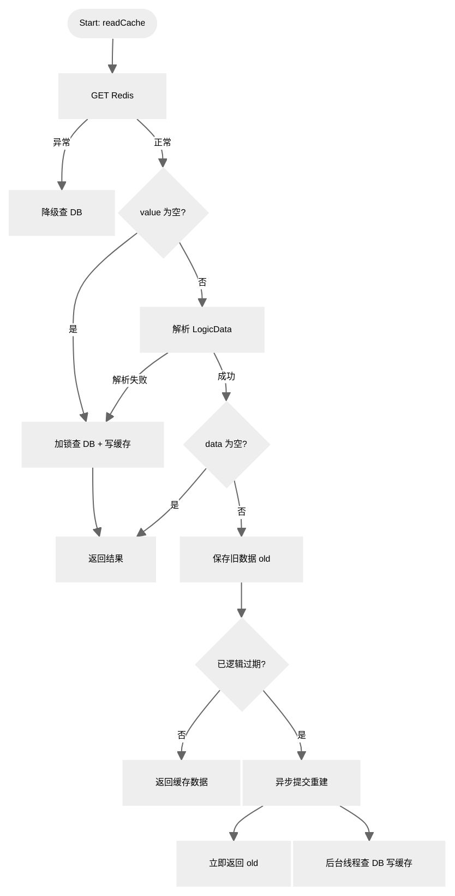

<div align="center">
  <h1>flowerpayment-ai 鲜花商店 + ai</h1>
  <h2>flowerpayment-ai：B2C 经营模式，一个花店卖家，多个买家。鲜花服务由店长、店员和客户组成。</h2>
  <h4>
    一个由 Spring Boot 3 + Vue 3 的前后端分离架构，中间件使用 Redis + nginx，主业务为鲜花礼品订单和支付的全栈系统和
    Spring AI（spring-ai-starter-model-openai + 阿里云），通过图像识别花材推荐相似花束，并支持 LLM 生成个性化贺卡文案。
  </h4>
</div>

<div align="center">
    <h1>
    
    
    
    
    
    
    
    </h1>
</div>
------

# 架构图

| 数据流向     |  |
| ------------ | ------------------------------------------------------------ |
| 总体设计     |  |
| 项目结构     | flower/<br/>├── spring-flower/            			  # 后端代码（Spring Boot 3 多模块）<br/>│   ├── common/                           # 公共模块<br/>│   ├── model/                            # 实体与数据传输对象<br/>│   ├── mapper/                           # 数据访问层（MyBatis-Plus）<br/>│   ├── service/                          # 业务逻辑模块<br/>│   ├── start/                            # 主业务启动模块<br/>│   └── ai/                           	  # AI服务启动模块<br/>│<br/>├── vue-flower/        					  # 前端管理端（Vue 3）<br/>│   ├── src/<br/>│   │   ├── api/                          # API接口封装（axios）<br/>│   │   ├── views/                        # 页面视图<br/>│   │   ├── layout/                       # 布局组件<br/>│   │   ├── router/                       # 路由配置(router)<br/>│   │   ├── stores/                       # 状态管理（Pinia）<br/>│   │   └── utils/                        # 工具函数<br/>│   └── package.json<br/>│<br/>├── database-sql/                  # 数据库脚本目录<br/>│   ├── sql.txt                    # 数据库create table<br/>│   ├── sql插入数据.txt              # 数据库初始化SQL<br/>│   └── 数据库设计文档.md             # 数据库设计说明<br/>│<br/>└── 说明/                          # 项目说明文档<br/>    ├── 原型功能/                   # 前端原型截图<br/>    ├── resource/                  # md文件使用<br/>    ├── 支付宝+qq/                  # 第三方应用注册和支付<br/>    ├── 并发测试                    # 使用jmeter测试<br/>    		├── flowr-category     使用springcache数据日志+结果<br/>    		├── flowr			   使用redis数据日志+结果<br/>    		├── festival		   使用redis数据日志+结果<br/>    ├── 运行日志.txt                # 运行日志<br/>    ├── admin接口文档.md            #admin接口详情<br/>    └── user接口文档.md             #user接口详情 |
| **升级方案** | 使用nacos+gateway连接主业务+ai业务(两个服务)，灰度更新，分布式部署，故障转移等等。待后续开发。<br>当前使用mysql存储ai会话内容，高消耗和延迟，可以改成redis的IO密集型，性能更强。待后续开发。 |

**订单状态流转**：

```
1 待支付 → 2 已付款 → 3 制作中 → 4 骑手待出发 → 5 配送中 → 6 已送达 → 7 已完成 
        → 8 已取消（未接单退款、商家拒单、超时取消、售后全额退款）
```

**第三方授权登录流程图和支付流程**：支付宝

| 支付宝授权 | 授权成功 | 集成到订单 | 支付过程 | 同步支付 | 异步检验 |
| :--: | :--: | ---- | ---- | :--: | :--: |
|  |  |  |  |  |  |

**第三方授权登录流程图和支付流程**：qq

| 待完善 |      |      |      |      |
| ------ | ---- | ---- | ---- | ---- |
|        |      |      |      |      |

# 启动步骤

1. 创建数据库并导入 `sql/` 目录脚本。
2. 修改 `start/src/main/resources/application-dev.yml` 中数据库与 Redis 配置。
3. `npm run dev ` 前端启动服务。

# 前端说明

技术栈：Vue 3 + Element Plus + Pinia + Vue Router + echarts

## 管理端界面

| 功能页面  |                             截图                             |
| :-------: | :----------------------------------------------------------: |
| 登录页面  |  |
|   分类    |                                                              |
| 单花销售  |                                                              |
| 组合销售  |                                                              |
| 订单管理  |                                                              |
|   店铺    |                                                              |
|   员工    |                                                              |
| 业务大屏1 |                                                              |
| 业务大屏2 |                                                              |
| 业务大屏3 |                                                              |

## 用户端界面

|     功能页面     | 截图 |
| :--------------: | ---- |
|     登录页面     |      |
|       分类       |      |
|     单花销售     |      |
|     组合销售     |      |
|       店铺       |      |
|      购物车      |      |
|       订单       |      |
| AI识别（多模态） |      |


# 后端说明

## 一、用户与员工双端登录认证模块

### 迭代过程

1. 早期版本：单过滤器 if-else 区分账号类型，新增 QQ / 支付宝第三方登录后逻辑爆炸；优化为过滤器链接力模式，解耦两套登录逻辑。
2. 早期只校验 JWT 签名，支持伪造永久 Token；新增 Redis 缓存校验，实现登录状态后端可控。
3. 最初使用固定 TTL，活跃用户频繁掉线；改造为滑动过期，留存提升明显。

### 分析

```
Q：为什么不用一个过滤器统一解析两种 Token？

答：单过滤器会出现大量类型判断分支，后续扩展第三方登录、多角色账号时维护成本极高；拆分过滤器采用接力放行模式，每个过滤器只关心自己对应的账号类型，符合开闭原则。

Q：滑动过期会不会产生大量无效 Redis Key？

答：设置最大基础 TTL 兜底，即使用户长期不操作，缓存自动(expire:24小时)淘汰；登出接口主动删除对应 key，减少无效缓存堆积。

Q: BCrypt 密码加密存储优点？

不使用 MD5/SHA256 不可逆哈希，BCrypt 自带随机盐值，抗彩虹表暴力破解，数据库永不存储明文密码。
```

------

## 二、flower-category模块

### model

1. 数据表 

   ```
   flower_category
   ```

   字段：id、分类名称、type 、排序、状态、删除标记；

   索引：type 普通索引，按类型快速筛选分类。

3. Redis 缓存结构，flower-category的并发量小，选择spring-cache缓存

   ```
   @CacheConfig(cacheNames = RedisPrefixConstant.CATEGORY_TYPE_PREFIX)
   ```

   key：type（1/2），value：全量分类列表 JSON；

   修改分类直接清空整个命名空间，规避无法枚举所有关联 key 的问题。

### 迭代过程
排除冷启动的第一次，无缓存的情况是全程没有使用 redis 的稳定情况，有缓存的情况是全程有 redis 的稳定情况
| 正常使用jmeter的100次并发                                    |                        |
| ------------------------------------------------------------ | ------------------------------------------------------------ |
| 没有缓存，再并发100次                                        |      |
| 日志                                                         | 说明/并发测试/flower-category-运行日志-没有缓存日志.txt      |
| 有spring-cache缓存，再并发100次                              |          |
| 日志                                                         | 说明/并发测试/flower-category-运行日志-缓存日志.txt          |
| 计算说明：性能提升百分比 =(无缓存值‑有缓存值)/ 无缓存值 ×100%；吞吐量提升百分比 =(有缓存‑无缓存)/ 无缓存 ×100%。 | **响应时间**：开启缓存后，接口平均、中位数、90/95/99 分位、最大、最小响应时间全部得到明显优化。无缓存场景平均响应时间 1508ms，开启缓存后平均响应时间降低至 427ms，平均响应性能提升**71.7%**。无缓存时服务需要完成完整业务逻辑、数据库查询；命中缓存直接读取缓存结果，极大降低业务处理耗时。 **吞吐量**：无缓存情况下系统吞吐量为 52.2 请求 / 秒；开启缓存后吞吐量达到 111.9 请求 / 秒，吞吐量提升**114.4%**，系统并发承压能力实现翻倍。 **网络流量**：受吞吐量提升影响，接收速率由 103.98KB/sec 提升至 222.73KB/sec，发送速率由 18.97KB/sec 提升至 40.64KB/sec，单位时间网络处理能力同步提升。 |

## 三、flower模块

### model

- `flower`鲜花单品（主表）：**分类 1:N 鲜花单品**，一个分类下有多条鲜花单品
- `flower_detail`鲜花规格（子表）：**鲜花单品 1:N 鲜花规格**，1 个鲜花可以有多条规格记录
- 联合唯一约束：`(flower_id,spec_object)`，同一个鲜花不能重复添加同一个送人对象规格。

**flower 表**

1. `PRIMARY KEY(id)`主键索引
2. `unique idx_flower_name(name)`鲜花名称唯一索引，保障鲜花名称不重复

**flower_detail 表**

1. `PRIMARY KEY(id)`主键索引
2. `unique idx_flower_spec(flower_id, spec_object)`联合唯一索引，避免同一个鲜花重复录入相同送人对象

---

**逻辑过期设计**




### 迭代过程

|           早期问题           |                           我的方案                           |
| :--------------------------: | :----------------------------------------------------------: |
|           缓存穿透           |          空值缓存 + 短 TTL60s，查询为空也写入 Redis          |
|           缓存击穿           | 逻辑过期 + Redisson 分布式锁 + 异步重建；持锁线程异步更新，其余请求返回旧缓存 |
|           缓存雪崩           | 基础 TTL 叠加 ±10% 随机偏移；列表、详情缓存设置不同过期周期  |
|       缓存数据库一致性       |                       兜底物理 TTL24h                        |
| 悲观锁不能解决集群和并发问题 | Redisson 可重入分布式锁 + 看门狗自动续期；加锁后双重检查缓存 |
|    redis宕机的突发性问题     | Redis 不可用：降级直查数据库<br> log.info("Redis 宕机:{}", e.getMessage()); Flower flower = this.getMysql(id); return BeanUtil.toBean(flower, FlowerVO.class); |

| 正常使用jmeter的100次并发    |      |
| ---------------------------- | ---- |
| 没有缓存，再开启100次并发    |      |
| 有redis缓存，再开启100次并发 |      |
|                              |      |

------

## 四、flower-detial模块

## 五、festival模块

## 六、festival-detail模块

## 七、user-address模块

## 八、user-shopping模块

## 九、order模块

## 十、业务大屏

## 十一、AI模块

## 十二、aop日志

## 十三、websocket


